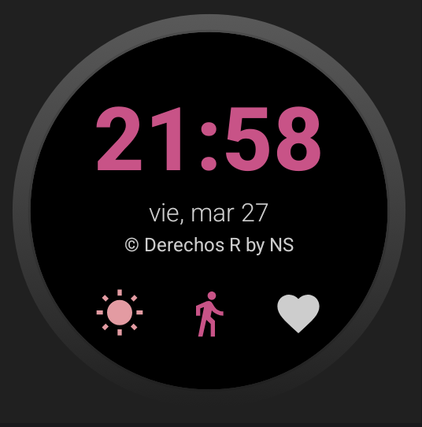

# ⌚ Simulación de Smartwatch

Aplicación desarrollada en **Kotlin** que simula el funcionamiento de un smartwatch, incluyendo funciones como alarma, música, ejercicios y una interfaz interactiva.

---

## 🚀 Descripción

Este proyecto consiste en una simulación de un reloj inteligente que permite al usuario interactuar con distintas funcionalidades comunes en dispositivos reales.

El objetivo es representar de manera visual y funcional cómo opera un smartwatch moderno, enfocándose en la experiencia del usuario y la navegación entre pantallas.

---

## 🛠️ Tecnologías utilizadas

- Kotlin
- Android Studio
- Desarrollo de interfaces móviles (UI)

---

## 📱 Funcionalidades

- ⏰ **Alarma**  
  Permite configurar y simular alertas.

- 🎵 **Música**  
  Simulación de reproducción de música.

- 🏃 **Ejercicios**  
  Sección dedicada a actividad física.

- 🖥️ **Pantalla de inicio**  
  Interfaz principal del smartwatch.

---

## 📸 Capturas del proyecto

> Asegúrate de que las imágenes estén en la carpeta `images`

### Pantalla de inicio


### Alarma


### Música


### Ejercicios


---

## ⚙️ Instalación

1. Clona este repositorio:
```bash
git clone https://github.com/NahomiiSofiaR/Simulacion-Smartwatch.git
